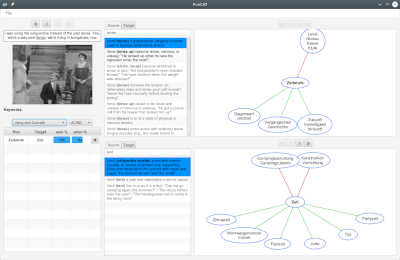

# PunCAT

PunCAT is an interactive prototype tool for the computer-assisted
translation of puns.  While it can be relatively easily adapted to
work with any pair of languages for which wordnets are available, it
currently supports only translation from English into German.

## Getting started

PunCAT is distributed as source code that must first be compiled.  It
depends on [GermaNet](http://www.sfs.uni-tuebingen.de/GermaNet/), a
proprietary resource that you must obtain separately and copy into the
PunCAT directory structure.  Please refer to the complete
[instructions for building, installing, and running
PunCAT](INSTALL.md).

The purpose and operation of PunCAT are described in detail in the two
papers cited in the following section.  To begin translating puns with
PunCAT, you must first open a corpus file using its **File > Open
corpus** command.  Sample corpus files are provided in the
[`src/main/resources/puns`](src/main/resources/puns) directory.  You
can also prepare your own corpus file according to the format
described by the XML schema
[`src/main/resources/puns/puncat.dtd`](src/main/resources/puns/puncat.dtd);
the values of the `first_sense` and `second_sense` attributes should
correspond to [sense
keys](https://wordnet.princeton.edu/documentation/senseidx5wn) from
[WordNet 3.0](https://wordnet.princeton.edu/).

If you wish to modify or further develop PunCAT, you can read about
[how to set up your development environment](DEVELOPING.md).

## Citing PunCAT

To refer to PunCAT in a scholarly work, please cite either or both of
the following publications:

- Waltraud Kolb and Tristan Miller. "Human–computer interaction in pun
  translation." In James Hadley, Kristiina Taivalkoski-Shilov, Carlos
  S. C. Teixeira, and Antonio Toral, editors, _Using Technologies for
  Creative-Text Translation_. Routledge, 2022. To appear.
- Tristan Miller. ["The punster's amanuensis: The proper place of
  humans and machines in the translation of
  wordplay."](https://dx.doi.org/10.26615/issn.2683-0078.2019_007) In
  _Proceedings of the Second Workshop on Human-Informed Translation
  and Interpreting Тechnology (HiT-IT 2019)_, pages 57–64,
  September 2019. DOI:
  [10.26615/issn.2683-0078.2019_007](https://dx.doi.org/10.26615/issn.2683-0078.2019_007).

## Credits

PunCAT was designed and written by [Tristan
Miller](https://logological.org/) and Máté Lajkó of the [Austrian
Research Institute for Artificial Intelligence
(OFAI)](https://www.ofai.at/).  Development was supported by the
[Austrian Science Fund (FWF)](https://www.fwf.ac.at/en/) under project
[M 2625-N31 (Computational
Pun-derstanding)](https://punderstanding.ofai.at/).

## Licence

PunCAT is free software: you can redistribute it and/or modify it
under the terms of the [GNU General Public
License](https://www.gnu.org/licenses/gpl-3.0.en.html) as published by
the Free Software Foundation, either version 3 of the License, or (at
your option) any later version.

## Contact

Bug reports and feature requests can be made on the [issue tracker](https://github.com/OFAI/PunCAT/issues).

Please direct any other questions or comments to [Tristan
Miller](https://logological.org/).
